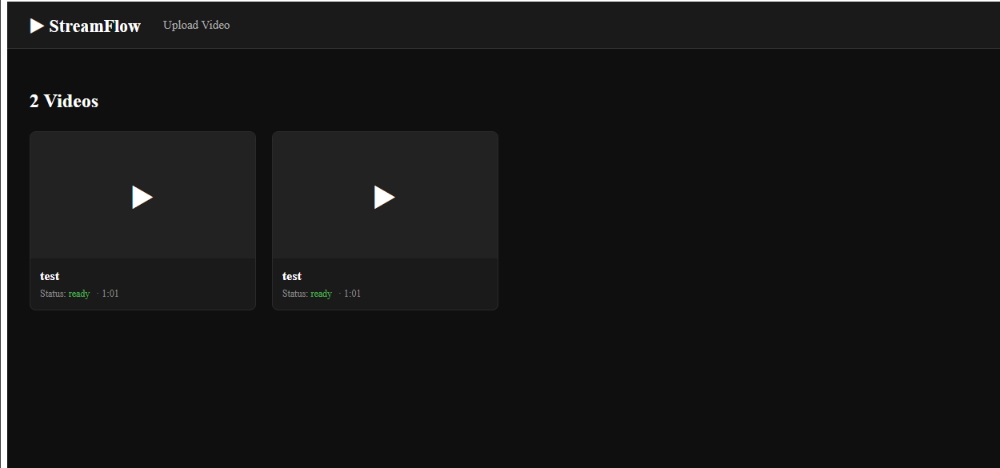
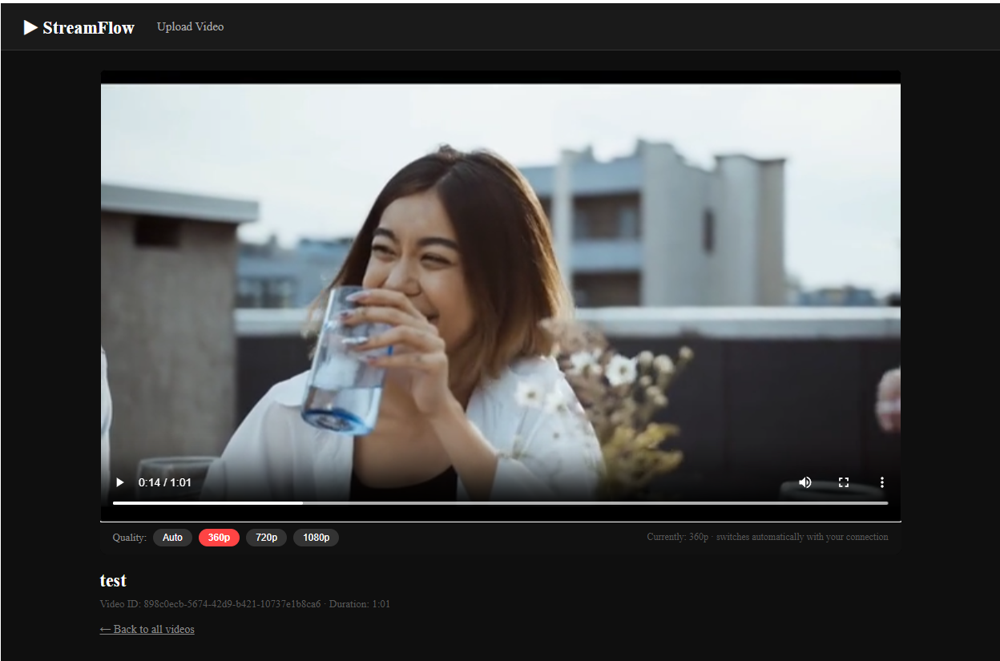
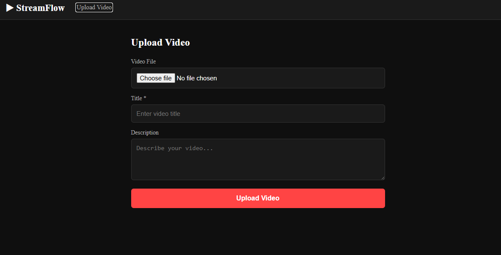
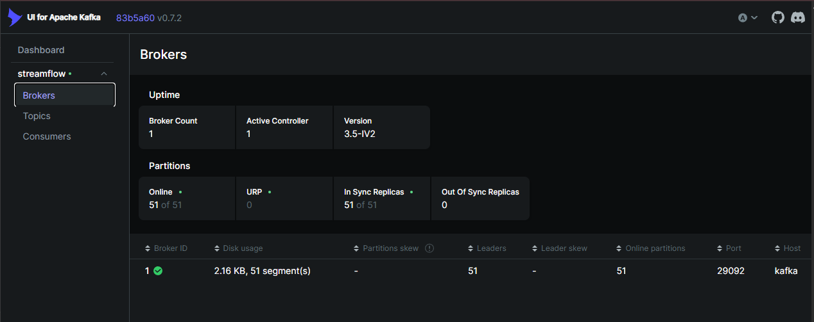
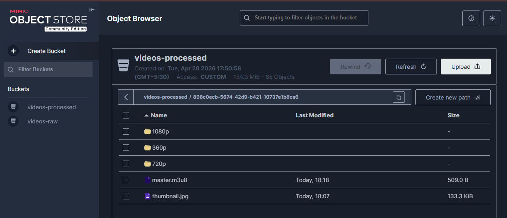

 Home Page | Video Player |
|-----------|-------------|
|  |  |
 
| Upload Page | Kafka UI (Job Queue) |
|-------------|---------------------|
|  |  |
 
| MinIO Console (Stored HLS Segments) |
|-------------------------------------|
|  |

## 🚀 What is StreamFlow?
 
StreamFlow is a **full-stack video streaming platform** that replicates the core infrastructure of platforms like YouTube and Netflix. Users upload videos which are automatically transcoded into multiple quality levels and delivered to the browser using **adaptive bitrate streaming** — the player automatically switches between 360p, 720p, and 1080p based on the viewer's network speed, in real time.
 
**This is not a tutorial project. Every architectural decision mirrors how real video platforms work at scale.**
 
---
 
## ✨ Key Features
 
- **Video Upload** — Chunked upload with real-time progress bar
- **Async Processing Pipeline** — Upload responds instantly; transcoding happens in the background via Kafka
- **Adaptive Bitrate Streaming (HLS)** — Automatic quality switching based on viewer bandwidth (360p / 720p / 1080p)
- **Object Storage** — MinIO (S3-compatible) stores all raw and processed video files
- **Event-Driven Architecture** — Apache Kafka decouples upload from processing; supports horizontal scaling
- **Auto Thumbnail Generation** — FFmpeg extracts a frame at 2 seconds as the video thumbnail
- **Live Processing Status** — Watch page polls every 5 seconds and updates automatically when ready
- **Interactive API Docs** — FastAPI auto-generates Swagger UI at `/docs`
- **Fully Containerized** — Every service runs in Docker; one command starts everything
---
 
## 🏗️ Architecture
 
```
┌─────────────────────────────────────────────────────────────────┐
│                        User's Browser                           │
│                    React + HLS.js Player                        │
└──────────┬──────────────────────────┬───────────────────────────┘
           │ Upload video             │ Stream HLS chunks
           ▼                         ▼
┌──────────────────┐      ┌──────────────────────┐
│   FastAPI        │      │   MinIO              │
│   API Gateway    │      │   (Object Storage)   │
│   Port 8000      │      │                      │
│                  │      │  videos-raw/         │
│  POST /upload    │      │  └─ {id}/original    │
│  GET  /videos    │      │                      │
│  GET  /videos/id │      │  videos-processed/   │
└──────┬───────────┘      │  └─ {id}/            │
       │                  │     ├─ master.m3u8   │
       │ Publish job      │     ├─ 360p/         │
       ▼                  │     ├─ 720p/         │
┌──────────────────┐      │     └─ 1080p/        │
│   Apache Kafka   │      └──────────────────────┘
│   Job Queue      │               ▲
│                  │               │ Upload HLS segments
│  video-processing│      ┌────────┴─────────────┐
│  -jobs topic     │─────▶│   Video Processor    │
│                  │      │   (Kafka Consumer)   │
└──────────────────┘      │                      │
                          │  1. Download raw     │
                          │  2. Generate thumb   │
                          │  3. FFmpeg → 360p    │
                          │  4. FFmpeg → 720p    │
                          │  5. FFmpeg → 1080p   │
                          │  6. Create playlist  │
                          │  7. Update DB        │
                          └──────────────────────┘
                                    │
                          ┌─────────┴────────────┐
                          │   PostgreSQL          │
                          │   Video Metadata      │
                          │   status: processing  │
                          │        → ready        │
                          └──────────────────────┘
```
 
### How Adaptive Bitrate Streaming Works
 
```
  Your Internet Speed          What You Watch
  ─────────────────            ──────────────
  > 5 Mbps          ────────▶  1080p  (crisp, full HD)
  1–5 Mbps          ────────▶  720p   (smooth HD)
  < 1 Mbps          ────────▶  360p   (no buffering)
 
  HLS.js measures download speed every 6 seconds
  and switches quality automatically — no buffering, no manual choice needed.
  This is exactly how YouTube and Netflix work.
```
 
---
 
## 🛠️ Tech Stack
 
| Layer | Technology | Purpose |
|-------|-----------|---------|
| **Frontend** | React 18 + HLS.js | Video player with adaptive bitrate, upload UI |
| **API** | FastAPI (Python 3.11) | REST API, file upload handling, video metadata |
| **Message Queue** | Apache Kafka | Async job queue — decouples upload from processing |
| **Video Processing** | FFmpeg | Transcodes video to HLS format at 3 quality levels |
| **Object Storage** | MinIO (S3-compatible) | Stores raw uploads and transcoded HLS segments |
| **Database** | PostgreSQL 15 | Video metadata (title, status, duration) |
| **Cache** | Redis | Session caching, future rate limiting |
| **Web Server** | Nginx | Serves React build in production |
| **Containerization** | Docker + Docker Compose | Runs all services locally with one command |
 
---
 
## 📁 Project Structure
 
```
streamflow/
├── docker-compose.yml          ← Starts ALL services with one command
├── .env                        ← All configuration (never committed to git)
│
├── api/                        ← FastAPI service
│   ├── Dockerfile
│   ├── requirements.txt
│   ├── main.py                 ← App entrypoint, startup initialization
│   ├── database.py             ← PostgreSQL async connection + table setup
│   ├── storage.py              ← MinIO client + bucket initialization
│   ├── kafka_producer.py       ← Publishes video jobs to Kafka
│   └── routers/
│       ├── upload.py           ← POST /api/upload/
│       └── videos.py           ← GET /api/videos/, GET /api/videos/{id}
│
├── processor/                  ← Video processing worker
│   ├── Dockerfile              ← Includes FFmpeg installation
│   ├── requirements.txt
│   ├── worker.py               ← Kafka consumer + FFmpeg transcoding pipeline
│   ├── database.py             ← Updates video status in PostgreSQL
│   └── storage.py              ← Downloads from / uploads to MinIO
│
└── frontend/                   ← React application
    ├── Dockerfile              ← Multi-stage: build → nginx
    ├── nginx.conf
    ├── public/index.html
    └── src/
        ├── index.js
        ├── App.jsx
        ├── components/
        │   └── VideoPlayer.jsx ← HLS.js adaptive player + quality switcher
        └── pages/
            ├── HomePage.jsx    ← Video grid with live status polling
            ├── UploadPage.jsx  ← Upload form with progress bar
            └── VideoPage.jsx   ← Watch page with auto-refresh
```
 
---
 
## ⚡ Quick Start
 
### Prerequisites
 
Make sure you have these installed:
 
| Tool | Version | Install |
|------|---------|---------|
| Docker Desktop | Latest | [docker.com](https://docker.com/products/docker-desktop) |
| Docker Compose | v2+ | Included with Docker Desktop |
| Node.js | 18+ | [nodejs.org](https://nodejs.org) |
 
### 1. Clone the repository
 
```bash
git clone https://github.com/YOUR_USERNAME/streamflow.git
cd streamflow
```
 
### 2. Set up environment variables
 
```bash
cp .env.example .env
# Default values work out of the box — no changes needed for local development
```
 
### 3. Start everything
 
```bash
docker compose up --build
```
 
This single command:
- Pulls all Docker images (Postgres, Kafka, MinIO, Redis)
- Builds the FastAPI and processor Docker images
- Builds the React frontend
- Starts all 9 services and connects them on a shared network
- Creates the PostgreSQL tables and MinIO buckets automatically
**First run takes 3–5 minutes** (downloading images). Subsequent runs take ~30 seconds.
 
### 4. Open the app
 
| URL | Service |
|-----|---------|
| http://localhost:3000 | React Frontend |
| http://localhost:8000/docs | FastAPI Interactive API Docs (Swagger) |
| http://localhost:9001 | MinIO Console (browse stored files) |
| http://localhost:8080 | Kafka UI (monitor job queue) |
 
**MinIO Console login:** `minioadmin` / `minioadmin`
 
---
 
## 🎯 How to Use
 
### Upload a Video
1. Go to http://localhost:3000
2. Click **Upload Video** in the nav bar
3. Choose any video file (MP4, MOV, AVI, WebM — up to 500MB)
4. Enter a title and click **Upload Video**
5. You'll be redirected to the watch page — it shows a processing spinner
### Watch the Pipeline in Action
While your video processes, open a new terminal and run:
```bash
docker compose logs processor -f
```
 
You'll see the transcoding happening live:
```
Processing video: abc-123...
Step 1: Downloading raw video from MinIO...
Step 2: Generating thumbnail...
Step 3: Transcoding to HLS quality levels...
  Running FFmpeg for 360p...  ✓
  Running FFmpeg for 720p...  ✓
  Running FFmpeg for 1080p... ✓
Step 4: Creating master playlist...
Step 5: Updating database...
✅ Video ready to stream!
```
 
### Watch the Video
After 1–5 minutes (depending on file size), the watch page automatically updates and the player appears. Use the quality buttons below the player to manually switch between 360p, 720p, and 1080p — or leave it on **Auto** to let HLS.js decide based on your connection speed.
 
---
 
## 🔍 Monitoring & Debugging
 
### Check all running services
```bash
docker compose ps
```
 
### View logs for any service
```bash
docker compose logs api -f          # FastAPI logs
docker compose logs processor -f    # FFmpeg transcoding logs
docker compose logs kafka -f        # Kafka broker logs
```
 
### Check video status in database
```bash
docker exec -it streamflow-postgres psql -U streamflow -d streamflow \
  -c "SELECT title, status, duration_seconds, updated_at FROM videos ORDER BY created_at DESC;"
```
 
### Browse stored files in MinIO
```bash
# List all transcoded HLS files
docker exec -it streamflow-minio-1 mc alias set local http://localhost:9000 minioadmin minioadmin123
docker exec -it streamflow-minio-1 mc ls local/videos-processed --recursive
```
 
### Scale the processor (handle multiple videos in parallel)
```bash
docker compose up --scale processor=3
# Kafka automatically distributes jobs between all 3 workers
```
 
---
 
## 🌊 Video Processing Pipeline (Deep Dive)
 
```
1. User uploads video.mp4 (500MB)
         │
         ▼
2. FastAPI receives file in memory
   ├── Validates file type (mp4, mov, avi, webm)
   ├── Generates UUID: abc-123-def
   ├── Uploads to MinIO: videos-raw/abc-123-def/original.mp4
   ├── Creates DB row: {id: abc-123, status: "processing"}
   └── Publishes to Kafka: {"video_id": "abc-123", "raw_key": "..."}
         │
         ▼  (immediately returns to user — "Upload received!")
         │
3. Kafka holds the job message (durable, survives restarts)
         │
         ▼
4. Processor picks up job from Kafka
   ├── Downloads original.mp4 from MinIO to /tmp/abc-123/
   ├── Runs FFmpeg → thumbnail.jpg (frame at 2 seconds)
   │
   ├── Runs FFmpeg → 360p HLS:
   │   ├── segment000.ts (6 seconds of video)
   │   ├── segment001.ts
   │   ├── segment002.ts ... (one per 6 seconds)
   │   └── index.m3u8    (playlist listing all segments)
   │
   ├── Runs FFmpeg → 720p HLS  (same structure)
   ├── Runs FFmpeg → 1080p HLS (same structure)
   │
   ├── Creates master.m3u8:
   │   #EXTM3U
   │   #EXT-X-STREAM-INF:BANDWIDTH=800000,RESOLUTION=640x360
   │   http://localhost:9000/videos-processed/abc-123/360p/index.m3u8
   │   #EXT-X-STREAM-INF:BANDWIDTH=2500000,RESOLUTION=1280x720
   │   http://localhost:9000/videos-processed/abc-123/720p/index.m3u8
   │   ...
   │
   ├── Uploads everything to MinIO: videos-processed/abc-123/
   └── Updates DB: {status: "ready", duration: 342}
         │
         ▼
5. Browser fetches master.m3u8
   HLS.js reads available quality levels
   Downloads 6-second segments one at a time
   Measures download speed after each segment
   Switches quality up/down automatically
```
 
---
 
## 🐳 Docker Architecture
 
Each service runs in its own isolated container on a shared `streamflow-net` bridge network. Containers discover each other by service name (e.g., `postgres`, `kafka`, `minio`) — no hardcoded IP addresses.
 
```
streamflow-net (bridge network)
├── streamflow-postgres    :5432   → data volume: postgres-data
├── streamflow-redis       :6379   → data volume: redis-data
├── streamflow-minio       :9000   → data volume: minio-data
├── streamflow-zookeeper   :2181   → (Kafka dependency)
├── streamflow-kafka       :9092
├── streamflow-kafka-ui    :8080
├── streamflow-api         :8000   → depends on: postgres, minio, kafka
├── streamflow-processor          → depends on: postgres, minio, kafka
└── streamflow-frontend    :3000
```
 
**Why Docker?**
- Run anywhere: developer laptop, Linux VPS, cloud VM — identical result
- No "works on my machine" — dependencies are frozen inside the image
- Each service is isolated: crashing one doesn't affect others
- This exact setup is Kubernetes-ready: each container = one K8s pod
---
 
## ☸️ Kubernetes Ready
 
This project is architected to deploy directly to Kubernetes with minimal changes:
 
| Docker Compose Concept | Kubernetes Equivalent |
|------------------------|----------------------|
| `services:` block | `Deployment` + `Service` |
| `environment:` variables | `ConfigMap` + `Secret` |
| `volumes:` | `PersistentVolumeClaim` |
| `depends_on:` | `readinessProbe` + `initContainers` |
| `--scale processor=3` | `HorizontalPodAutoscaler` |
 
All services follow the **12-Factor App** methodology:
- Configuration via environment variables
- Stateless processes (databases are separate)
- Health check endpoint at `GET /health`
- Services communicate by hostname, not IP
---
 
## 📡 API Reference
 
Full interactive documentation available at **http://localhost:8000/docs**
 
| Method | Endpoint | Description |
|--------|----------|-------------|
| `GET` | `/health` | Service health check |
| `POST` | `/api/upload/` | Upload a video file |
| `GET` | `/api/videos/` | List all videos |
| `GET` | `/api/videos/{id}` | Get video details + stream URL |
 
### Upload Request
```bash
curl -X POST http://localhost:8000/api/upload/ \
  -F "file=@/path/to/video.mp4" \
  -F "title=My First Video" \
  -F "description=A test upload"
```
 
### Upload Response
```json
{
  "video_id": "abc-123-def-456",
  "title": "My First Video",
  "status": "processing",
  "message": "Video uploaded! Transcoding started."
}
```
 
### Get Video Response (when ready)
```json
{
  "id": "abc-123-def-456",
  "title": "My First Video",
  "status": "ready",
  "duration_seconds": 342,
  "stream_url": "http://localhost:9000/videos-processed/abc-123/master.m3u8",
  "thumbnail_url": "http://localhost:9000/videos-processed/abc-123/thumbnail.jpg",
  "created_at": "2026-04-28T10:30:00"
}
```
 
---
 
## 🧠 Why These Technologies?
 
**FastAPI over Flask/Django**
FastAPI is async-first, automatically generates OpenAPI documentation, and has built-in request validation via Pydantic. It's the fastest-growing Python web framework for APIs and is used in production at Microsoft, Uber, and Netflix.
 
**Kafka over a database queue**
A database queue (polling a table) needs locks, has polling delay, and doesn't scale horizontally without complex logic. Kafka is purpose-built for this: it's durable (messages survive restarts), supports replay (reprocess failed jobs), and distributes work across consumers automatically — scale processors from 1 to 10 with zero code changes.
 
**MinIO over local filesystem**
Local filesystem doesn't work when you run multiple containers — each has its own disk. MinIO provides a single shared storage layer accessible by all services, using the industry-standard S3 API. Moving to AWS S3 in production requires changing one environment variable.
 
**HLS over direct MP4 serving**
Serving a raw MP4 requires the entire file to be downloaded before playback begins. HLS (HTTP Live Streaming) splits video into 6-second chunks — playback starts after the first chunk. It also enables adaptive bitrate: the player downloads the next chunk at the quality that matches your current bandwidth. No buffering.
 
---
 
## 🗺️ Future Improvements
 
- [ ] User authentication (JWT)
- [ ] Video search and filtering
- [ ] Comments and likes
- [ ] CDN integration for global distribution
- [ ] Kubernetes deployment with HorizontalPodAutoscaler
- [ ] Prometheus + Grafana monitoring dashboard
- [ ] Video chapters and timestamps
- [ ] WebSocket notifications when processing completes
---
 
## 📄 License
 
MIT License — feel free to use this project however you like.
 
---
 
## 👤 Author
 
**Abhishek**
- GitHub: [@abhishek-codeit](https://github.com/abhishek-codeit)
- LinkedIn: [linkedin.com/in/abhisheks-codeit](www.linkedin.com/in/abhisheks-codeit)
---
 
> Built to demonstrate production-grade distributed systems design — event-driven architecture, adaptive media delivery, containerized microservices, and scalable object storage.
 